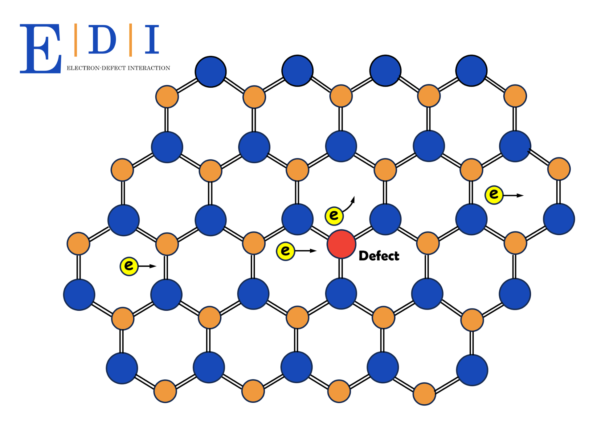
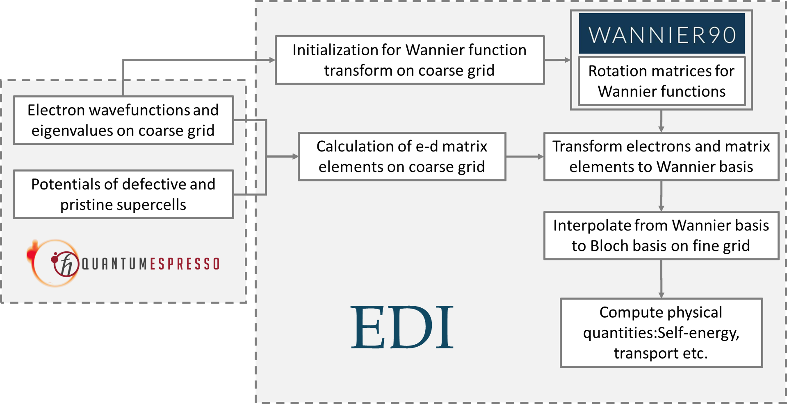
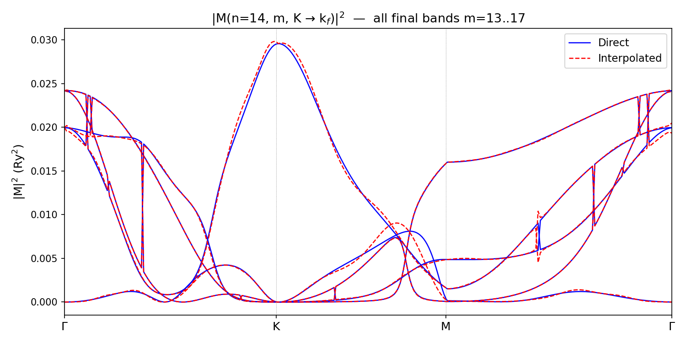

<p align="center">
  
</p>

# EDI: Electron-Defect Interaction

A Quantum ESPRESSO plugin for computing electron-defect scattering matrix elements and carrier transport properties from first principles.

EDI uses the supercell approach to extract defect perturbation potentials, Wannier interpolation to evaluate matrix elements on arbitrarily fine k-grids, and the Boltzmann transport equation (BTE) to compute defect-limited carrier mobility in both 2D and 3D materials.

## Features of EDI version 2.0

- **Electron-defect matrix elements** via the supercell difference-potential method: `M(k_i, k_f) = <psi_ki | V_defect - V_pristine | psi_kf>`, including both local and nonlocal (Kleinman-Bylander) contributions
- **Wannierization of matrix elements** from Bloch to Wannier representation `M(R, R')` for efficient interpolation to dense k-grids
- **Wannier90 integration** for interpolation of band structure (energies, velocities) and matrix elements 
- **SERTA and MRTA mobility** with irreducible Brillouin zone (IBZ) symmetry exploitation
- **Multiple delta function methods**: triangular (2D), fixed Gaussian, and adaptive Gaussian (velocity-dependent smearing)
- **Spin-orbit coupling (SOC)** support: two-component spinor wavefunctions, `dvan_so` nonlocal pseudopotentials, automatic detection from QE save files
- **MPI parallelization** with pool-based (ki, kf) pair distribution and panel broadcast for memory-efficient wavefunction sharing
- **Automated setup**: Python scripts generate all supercell and primitive cell inputs from a single `scf.in`
- **One-shot potential extraction** by extract_pot.x

## Workflow
<p align="center">
  
</p>


## Prerequisites

- [Quantum ESPRESSO 7.5](https://www.quantum-espresso.org/) compiled with [Wannier90](https://wannier.org/)
- MPI-enabled Fortran compiler (tested with AOCC 3.1.0, GCC, Intel)
- FFTW3 library
- Python 3 with NumPy (for setup scripts only)

## Building

If you are using Anvil, before compilation, the modules can be set up as:

```bash
module reset
module load aocc/3.1.0 openmpi/4.1.6
module load amdblis/3.0 amdlibflame/3.0 amdlibm/3.0 fftw

```


EDI is built as a plugin inside the QE source tree. Place this repository at `<QE-root>/edi-code/`:

```bash
cd <QE-root>
git clone git@github.com:rjguo1208/edi-dev.git edi-code
cd edi-code
make
```

This compiles QE's `pw.x` (if not already built) and then builds `edi.x` in `src/`.

To build only `edi.x` (assuming QE libraries are already compiled):

```bash
cd src
make
```

A typical EDI calculation proceeds in four stages:

```
Stage 1: DFT (pw.x)              Stage 2: EDI (edi.x)
  Primitive cell SCF                Wannierize bands
  Primitive cell NSCF               Compute M(R, R') via double-FT
  Pristine supercell SCF            Interpolate M to fine k-grid
  Defect supercell SCF              Compute scattering rates & mobility
```

### Step 1: Prepare DFT inputs

Use `gen_supercell.py` to automatically generate all QE input files from a primitive cell `scf.in`:

```bash
# S vacancy in a 6x6x1 MoS2 supercell
python script/gen_supercell.py \
    --input scf.in \
    --nx 6 --ny 6 --nz 1 \
    --defect vacancy --site-species S \
    --nprocs 72 --output ./edi_run/
```

This generates the following directory structure:

```
edi_run/
  primitive/scf.in          # Primitive cell SCF
  primitive/nscf.in         # Primitive cell NSCF on coarse k-grid
  pristine_super/scf.in     # Pristine supercell SCF
  defect_super/scf.in       # Defect supercell SCF
  edi/edi.in                # EDI input file
  run_all.sh                # Full pipeline job script
```

Supported defect types:

```bash
# Vacancy (remove one atom)
python script/gen_supercell.py --input scf.in --nx 6 --ny 6 --nz 1 \
    --defect vacancy --site-species S

# Substitution (replace S with O)
python script/gen_supercell.py --input scf.in --nx 6 --ny 6 --nz 1 \
    --defect substitution --site-species S \
    --new-species O --new-mass 15.999 --new-pseudo O_ONCV_PBE_FR-1.0.upf

# Interstitial (insert atom at specified position)
python script/gen_supercell.py --input scf.in --nx 3 --ny 3 --nz 3 \
    --defect interstitial \
    --new-species Li --new-mass 6.941 --new-pseudo Li.upf \
    --interstitial-pos 0.5 0.5 0.5
```

### Step 2: Run DFT calculations

```bash
# Primitive cell
cd primitive
mpirun -np 72 pw.x -nk 8 < scf.in  > scf.out
mpirun -np 72 pw.x -nk 8 < nscf.in > nscf.out

# Supercells
cd ../pristine_super
mpirun -np 72 pw.x < scf.in > scf.out
cd ../defect_super
mpirun -np 72 pw.x < scf.in > scf.out
```

### Step 3: Extract potentials and Run EDI

```bash
cd edi
srun -n 1 extract_pot.x -i extract_pot.in > extract_pot.out
srun -n 72 edi.x -nk 72 -i edi.in > edi.out
```

The `-nk` flag sets the number of k-point pools for MPI parallelization. For transport calculations, use `-nk` equal to the total number of MPI ranks for best performance.

### Step 4: Output files

EDI produces:

| File | Description |
|------|-------------|
| `prefix_transport.dat` | Mobility vs temperature (SERTA and MRTA, xx and yy components) |
| `prefix_inv_tau.dat` | State-resolved inverse lifetimes 1/tau(n,k) and tau(n,k) |
| `prefix_edmatw_2d.bin` | Wannier-basis matrix elements M(R, R'), reusable with `edwread = .true.` |

## Input Reference

EDI reads a single Fortran namelist `&edinput_nml` from the input file.

### General Settings

| Parameter | Type | Default | Description |
|-----------|------|---------|-------------|
| `edi_prefix` | string | `'pwscf'` | Prefix of primitive cell QE calculation |
| `edi_outdir` | string | `'./'` | Output directory containing primitive cell QE save data |

### Supercell Potentials

| Parameter | Type | Default | Description |
|-----------|------|---------|-------------|
| `potfile_d` | string | | Cube file for defect supercell potential (from `extract_pot.x`) |
| `potfile_p` | string | | Cube file for pristine supercell potential (from `extract_pot.x`) |
| `pot_align` | string | `'vacuum'` | Potential alignment: `'vacuum'` (2D), `'core'`, or `'none'` |
| `defect_center(3)` | real | 0,0,0 | Defect center in supercell fractional coords (for `pot_align='core'`) |
| `core_align_radius` | real | 2.0 | Averaging sphere radius in Bohr (for `pot_align='core'`) |

### Matrix Element Calculation

| Parameter | Type | Default | Description |
|-----------|------|---------|-------------|
| `do_edmat` | logical | `.false.` | Compute matrix elements from supercell potentials |
| `pristine_prefix` | string | | Prefix of pristine supercell calculation (for on-the-fly loading) |
| `pristine_outdir` | string | | Output directory of pristine supercell (for on-the-fly loading) |
| `defect_prefix` | string | | Prefix of defect supercell calculation (for on-the-fly loading) |
| `defect_outdir` | string | | Output directory of defect supercell (for on-the-fly loading) |
| `edwwrite` | logical | `.true.` | Write Wannier-basis M(R) to binary file after computation |
| `edwread` | logical | `.false.` | Read M(R) from binary file, skipping recomputation |
| `band_ed` | string | | Band range for direct calculation mode (e.g., `'13-17'`) |

### Wannier90 Settings

| Parameter | Type | Default | Description |
|-----------|------|---------|-------------|
| `wannierize` | logical | `.false.` | Run Wannier90 minimization (`.false.` reuses existing `.chk`) |
| `nbndsub` | integer | 0 | Number of Wannier functions |
| `dis_win_min` / `dis_win_max` | real | +/-9999 | Disentanglement outer window (eV) |
| `dis_froz_min` / `dis_froz_max` | real | +/-9999 | Disentanglement frozen window (eV) |
| `num_iter` | integer | 200 | Maximum Wannier90 iterations |
| `proj(i)` | string | | Projection strings (e.g., `'Mo:d'`, `'S:p'`) |
| `wdata(i)` | string | | Additional Wannier90 `.win` file entries |
| `bands_skipped` | string | | Bands to exclude (e.g., `'exclude_bands = 1-12'`) |
| `auto_projections` | logical | `.true.` | Use automatic projections (SCDM) |

### K-grids

| Parameter | Type | Default | Description |
|-----------|------|---------|-------------|
| `coarse_nk1` / `nk2` / `nk3` | integer | 0 | Coarse k-grid dimensions (must match the primitive cell NSCF) |
| `fine_nk1` / `nk2` / `nk3` | integer | 0 | Fine k-grid for Wannier interpolation and transport |

### Transport Settings

| Parameter | Type | Default | Description |
|-----------|------|---------|-------------|
| `do_transport` | logical | `.false.` | Enable transport calculation |
| `transport_win_min` | real | -9999 | Energy window lower bound (eV) |
| `transport_win_max` | real | 9999 | Energy window upper bound (eV) |
| `carrier_conc` | real | 1e13 | Carrier concentration (cm^-2 for 2D, cm^-3 for 3D) |
| `defect_conc` | real | 1e12 | Defect concentration (cm^-2 for 2D, cm^-3 for 3D) |
| `nstemp` | integer | 1 | Number of temperature points |
| `temps(i)` | real | 300.0 | Temperature values in Kelvin |
| `delta_method` | string | `'triangular'` | Delta function: `'triangular'`, `'gaussian'`, or `'adaptive'` |
| `delta_sigma` | real | 0.1 | Fixed Gaussian broadening (eV), used when `delta_method = 'gaussian'` |

### Custom K-point Modes

| Parameter | Type | Default | Description |
|-----------|------|---------|-------------|
| `edmat_direct_from_file` | logical | `.false.` | Compute M(ki,kf) directly for k-points listed in files |
| `filki_direct` / `filkf_direct` | string | | Input k-point files for direct mode (crystal coordinates) |
| `edmat_interp_from_file` | logical | `.false.` | Interpolate M(ki,kf) for k-points listed in files |
| `filki_interp` / `filkf_interp` | string | | Input k-point files for interpolation mode |

## Example Input

### extract_pot.in (potential extraction, run with 1 MPI rank)

```fortran
&extract_pot_nml
  defect_prefix   = 'mos2_defect'
  defect_outdir   = '../defect_super/dout/'
  pristine_prefix = 'mos2_pristine'
  pristine_outdir = '../pristine_super/dout/'
  potfile_d = 'V_d.cube'
  potfile_p = 'V_p.cube'
/
```

### edi.in (full calculation)

```fortran
&edinput_nml
  ! Primitive cell
  edi_prefix = 'mos2'
  edi_outdir = '../primitive/dout/'

  ! Pre-extracted supercell potentials (from extract_pot.x)
  potfile_d = 'V_d.cube'
  potfile_p = 'V_p.cube'
  pot_align = 'vacuum'

  ! Matrix elements
  do_edmat = .true.

  ! Wannierization
  wannierize = .true.
  nbndsub = 5
  dis_win_min = -7.0
  dis_win_max = -0.8
  dis_froz_min = -7.0
  dis_froz_max = -3.4
  num_iter = 1000
  auto_projections = .false.
  proj(1) = 'Mo:d'
  bands_skipped = 'exclude_bands = 1-12'

  ! K-grids
  coarse_nk1 = 18
  coarse_nk2 = 18
  coarse_nk3 = 1
  fine_nk1 = 300
  fine_nk2 = 300
  fine_nk3 = 1

  ! Transport
  do_transport = .true.
  transport_win_min = -4.25
  transport_win_max = -4.10
  carrier_conc = 1.0e10
  defect_conc = 1.0e12
  delta_method = 'gaussian'
  delta_sigma = 0.01
  nstemp = 3
  temps(1) = 100.0
  temps(2) = 200.0
  temps(3) = 300.0
/
```

### Reuse previously computed Wannier matrix elements (skip Part A)

```fortran
&edinput_nml
  edi_prefix = 'mos2'
  edi_outdir = '../primitive/dout/'
  potfile_d = 'V_d.cube'
  potfile_p = 'V_p.cube'
  edwread = .true.         ! read M(R) from file
  wannierize = .false.     ! reuse existing Wannier90 checkpoint
  nbndsub = 5
  coarse_nk1 = 18, coarse_nk2 = 18, coarse_nk3 = 1
  fine_nk1 = 300, fine_nk2 = 300, fine_nk3 = 1
  do_transport = .true.
  transport_win_min = -4.25, transport_win_max = -4.10
  carrier_conc = 1.0e10, defect_conc = 1.0e12
  delta_method = 'gaussian', delta_sigma = 0.01
  nstemp = 1, temps(1) = 300.0
/
```

## Source Code Structure

All Fortran source files are in `src/` (26 files):

### Core

| File | Description |
|------|-------------|
| `edi.f90` | Main program: reads input, orchestrates Wannierization, matrix elements, transport |
| `edi_input.f90` | Namelist parsing (`&edinput_nml`), parameter broadcasting |
| `edic_mod.f90` | Shared data types (`V_file` for supercell potentials), workspace arrays |

### Potential Extraction

| File | Description |
|------|-------------|
| `extract_pot.f90` | Standalone program (`extract_pot.x`): reads QE save files and writes supercell KS potentials to cube files with full double precision. Run serially (1 MPI rank) before `edi.x`. |

### Matrix Elements

| File | Description |
|------|-------------|
| `ed_coarse.f90` | Core computation: supercell potential folding, spinor FFT, double Fourier transform, panel broadcast MPI, direct/interpolation modes, cube file reader |
| `get_betavkb.f90` | Kleinman-Bylander beta projectors for nonlocal pseudopotentials |
| `get_vloc_onthefly.f90` | On-the-fly extraction of supercell potentials (V_loc + V_xc) from QE save files (legacy, used when `potfile_d/p` not set) |

### Wannier Interpolation

| File | Description |
|------|-------------|
| `wannierize.f90` | Wannier90 driver: spread minimization, checkpoint I/O |
| `edbloch2wan.f90` | Bloch-to-Wannier transformation of electron-defect matrix elements |
| `wan2bloch.f90` | Wannier-to-Bloch interpolation of Hamiltonian and matrix elements on fine grids |
| `edi_read_hr.f90` | Reader for Wannier90 `_hr.dat` (Hamiltonian in Wannier basis) |
| `wigner_seitz.f90` | Wigner-Seitz supercell construction for real-space lattice vectors and degeneracies |
| `wann_common.f90` | Shared Wannier90 data: U matrices, lattice vectors, band mapping |

### Transport

| File | Description |
|------|-------------|
| `transport.f90` | Boltzmann transport: IBZ symmetry, SERTA/MRTA scattering rates, Fermi level bisection, mobility with spin degeneracy |
| `delta_weights.f90` | Energy-conserving delta function: triangular (2D), Gaussian (fixed/adaptive) |
| `bz_symmetry.f90` | Irreducible BZ construction and symmetry mapping |
| `ep_constants.f90` | Physical constants (Rydberg, Bohr, etc.) |

### Quantum ESPRESSO Interface

| File | Description |
|------|-------------|
| `edi_pw2wan.f90` | High-level interface between QE wavefunctions and Wannier90 |
| `pw2wan_edi.f90` | Low-level pw2wannier90 routines: AMN, MMN, eigenvalue extraction |
| `io_edi.f90` | Wavefunction I/O utilities |
| `io_var_edi.f90` | I/O variable declarations |
| `input_edi.f90` | Input module data structures |
| `kfold_edi.f90` | K-point folding and mapping for Wannier90 |
| `openfilepw_edi.f90` | QE file opening utilities |
| `low_lvl_edi.f90` | Low-level utility routines |
| `parallelism_edi.f90` | MPI pool distribution utilities |
| `global_var.f90` | Global band indices and kept-band mapping |

### Helper Scripts (`script/`)

| File | Description |
|------|-------------|
| `gen_supercell.py` | CLI tool: generates all DFT and EDI input files from a primitive cell `scf.in` |
| `supercell.py` | Library: supercell construction, defect insertion (vacancy/substitution/interstitial), coordinate transforms |
| `qe_input.py` | Library: QE input file parser and writer |
| `gen_pp_inputs.py` | Library: EDI input file and SLURM job script generator |

## Theory

### Scattering Rate

EDI computes the defect-limited scattering rate from Fermi's golden rule:

```
1/tau_{nk} = (2pi/hbar) * n_d * (1/N_k) * sum_{m,k'} |M_{nk,mk'}|^2 * delta(E_nk - E_mk')
```

where `n_d` is the number of defects per unit cell and `M` is the electron-defect matrix element.

### Matrix Element

The electron-defect matrix element is computed using the supercell difference-potential method:

```
M_{nk,mk'} = <psi_nk| Delta_V |psi_mk'>
            = M_local + M_nonlocal(defect) - M_nonlocal(pristine)
```

where `Delta_V = V_defect - V_pristine`. The local contribution sums over spinor components (sigma = up, down for SOC):

```
M_local = sum_sigma integral psi*_{nk,sigma}(r) * Delta_V(r) * psi_{mk',sigma}(r) dr
```

The nonlocal contribution uses scalar-relativistic `D_{ij}` or fully-relativistic `D^{sigma,sigma'}_{ij}` (SOC) Kleinman-Bylander projectors.


### Wannier Interpolation

Matrix elements are transformed from Bloch to Wannier representation:

```
M(R, R') = (1/N_k^2) * sum_{k,k'} exp(+ik*R) * exp(-ik'*R') * U_dag(k) * M_B(k,k') * U(k')
```

The inverse transform interpolates M to arbitrary fine k-grids:

```
M_W(k,k') = sum_{R,R'} exp(-ik*R) * exp(+ik'*R') * M(R, R') / (deg_R* deg_R')
```

<p align="center">
  
</p>
<p align="center"><em>Validation of Wannier-interpolated matrix elements (lines) against direct DFT calculation (dots) along the high-symmetry path Gamma-K-M-Gamma in MoS2.</em></p>

### Mobility

The Boltzmann transport mobility (SERTA) is:

```
mu_{alpha,beta} = (g_s * e) / n * (1/N_k) * sum_{nk} v_alpha * v_beta * tau_{nk} * (-df/dE)
```

where `g_s = 2` (collinear, spin-degenerate) or `g_s = 1` (SOC), and the Fermi level is determined self-consistently from the carrier concentration via bisection at each temperature.

## References

- X. XX et al., "EDI: Electron-defect interaction and defect-limited transport from first principle," (in preparation)
- A. A. Mostofi et al., "An updated version of wannier90: A tool for obtaining maximally-localised Wannier functions," [Comput. Phys. Commun. 185, 2309 (2014)](https://doi.org/10.1016/j.cpc.2014.05.003)
- P. Giannozzi et al., "Quantum ESPRESSO toward the exascale," [J. Chem. Phys. 152, 154105 (2020)](https://doi.org/10.1063/5.0005082)

## License

This software is distributed under the GNU General Public License v3.0. See the QE license for details.
