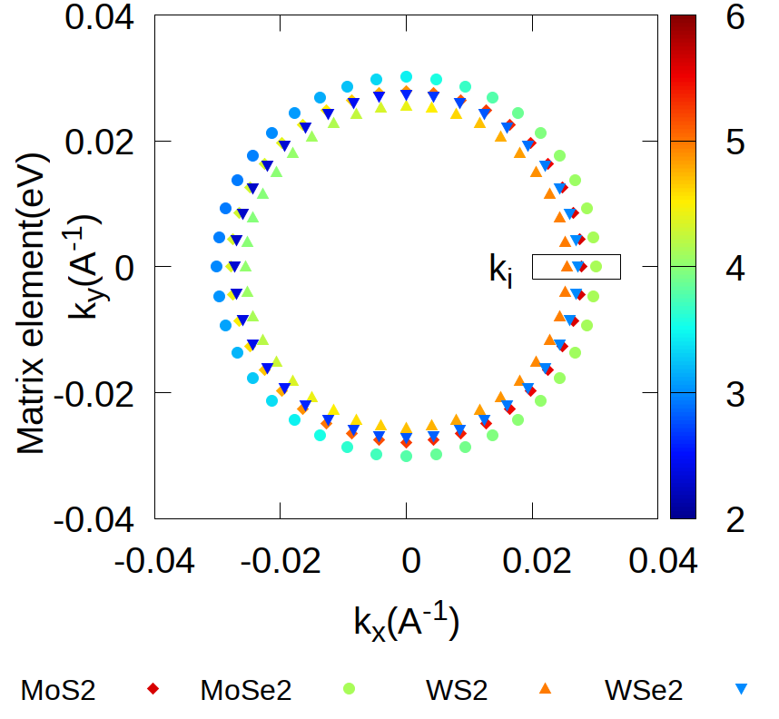

To develop advanced materials and devices, it is crucial to understand the processes involving electrons and atomic defects in the solid state. 
This requires computational tools that can predict the physical properties of materials by taking into account their atomic and electronic structure. 
EDI(electron-defect interaction) is a validated code that provides a unified platform for computing electron interactions, transport, and ultrafast dynamics in materials. 
It uses established first-principles methods such as density functional theory (DFT) as starting points for computing electron dynamics. 
The current distribution of EDI focuses on electron-defect (e-d) interactions and related transport properties, including electrical conductivity, scattering rate, and mobility. 
It also includes routines for computing spin-related infromation. 
The transport module enables accurate calculations of charge transport in a wide range of functional materials. 
The code is efficient with MPI parallelization, and scales linearly with the supercell size, thus only limited by the DFT code.

# Capabilities

- Calculate electron-defect scattering matrix element 

- Find reduced k-point sampling using triangular integral algorithm

- Calculate carrier mobility limited by both neutral and charged defect as a function of carrier concentration

  {:refdef: style="text-align: center;"}
   {:height="394px" width="429px"}
  {: refdef}

# Performance 

EDI uses optimal algorithm to calculate different part of scattering matrix element, giving the optimal performance of accuracy and effeciency.
The scalability of EDI is very good for system size. 
The calcualtion cost scales linearly with the volum of super cell, making it capable of calculating large systems easily.
Calculation of matrix element is parallelizede over k point pairs. 
EDI could easily run on large HPCs and utilize the full capacity.

# Reference
The reference could be found at [arxiv](./another-page.html).

