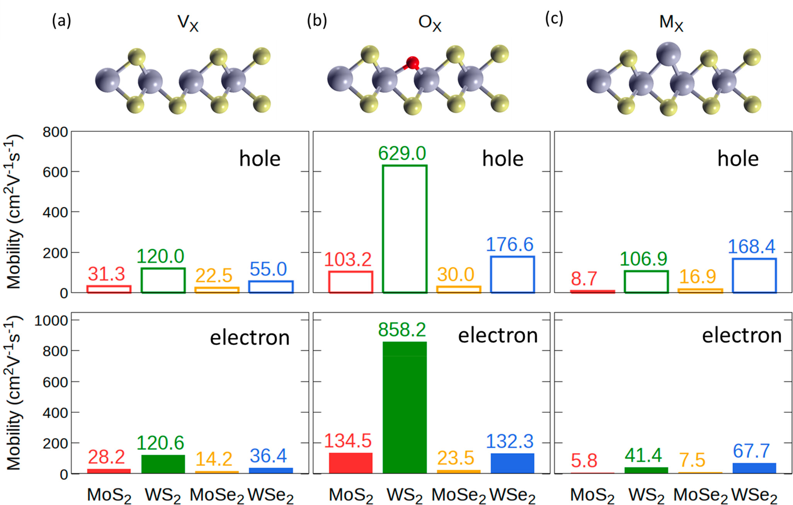

# Point Defect scattering

## Description
Electron-point-defect interaction plays a significant role in electron transport in materials. Point defects are the localized disruptions in the atomic structure, such as vacancies, interstitial atoms, or substitutional impurities, which affect the carrier transport. This code provides a method to accurately capture the electron-point-defect interations from first principle. By calculating electron-point-defect scattering matrix elements, we can obtain the carrier mobility limited by specific point-defects.

Documentation for neutral defect: https://point-defect.readthedocs.io

## Example outputs
Below are the calculated room-temperature charge carrier mobilities for 2D (monolayer) MX2 with different defect types.

  

## References
More details can be found at: https://pubs.acs.org/doi/full/10.1021/acsnano.4c01033

