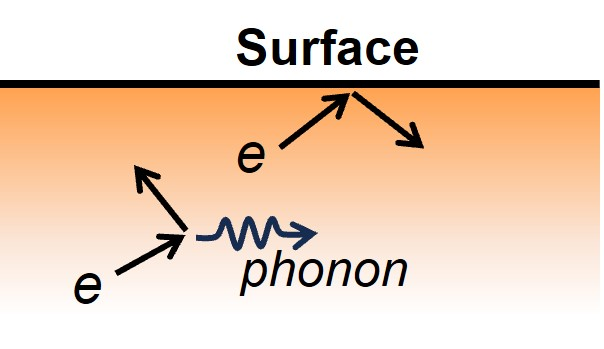

# surface_scattering



Solves the spatial Boltzmann Transport Equation (BTE) to evaluate finite-size resistivity in films, accounting for electron-surface and electron-phonon scattering.

## Description
Electron-surface (e-s) scattering plays a significant role in electron transport in materials. Existing theories usually require phenomenological parameters that need to be fitted to experimental data or are based on assumptions. Other theories calculate e-s scattering from first principles but often neglect its complex interaction with other scattering mechanisms (e.g., electron-phonon (e-ph) scattering), which collectively determine electron transport. This code provides a method to accurately capture the intricate interactions between e-s scattering and e-ph scattering from first principles and demonstrates their collective effect on electron transport in thin films by solving the 1D spatially dependent Boltzmann Transport Equation (BTE).


## Inputs
There are two main drivers for the BTE solver:

- **`SlabCond`** in `slabcond.py`: Uses the relaxation time approximation.
- **`IterSlabCond`** in `iter_slabcond.py`: Uses an iterative solution.

Both solvers require the following inputs from first-principles calculations:

- Electronic band energy
- Electronic group velocity
- Scattering rates due to electron-phonon scattering
- Electron-surface reflection coefficients
- Symmetry matrices of the lattice structure

Additionally, the iterative driver `IterSlabCond` requires the state-to-state electronic transition matrix as input. The sparse matrix data structure and the irreducible Brillouin Zone (BZ) are used to make the transition matrix manageable on personal computers. Therefore, in most cases, the symmetry matrices are also required to determine the correlation between the irreducible BZ and the full BZ.

## How to obtain input files

- **Electronic Band Energy and Group Velocity**: Calculated using [Wannier90](http://www.wannier.org/), especially when a dense uniform mesh grid is required.
- **Electron-Phonon Coupling Matrix and Self-Energy**: Evaluated using the EPW package in [Quantum ESPRESSO](https://www.quantum-espresso.org/).
- **Electron-Surface Reflection Coefficients**: Extracted from output files generated by [PWCOND](https://www.quantum-espresso.org/Doc/INPUT_PWCOND.html), a ballistic transport simulation package in Quantum ESPRESSO.
- **Symmetry Matrices**: Obtained from standard output files of `pw.x` in Quantum ESPRESSO, which contain all detected symmetry matrices.

## Outputs
Both BTE solvers generate similar results:

- **Bulk Conductivity**: The conductivity of the bulk material, without surfaces.
- **Local Conductivity Distribution**: The spatial distribution of local conductivity within the film.
- **Relative Resistivity**: The film resistivity normalized by bulk resistivity, used to quantify the impact strength of surface scattering.

## Example
Below is an example showing how to use the `SlabCond` class to calculate slab conductivity using the relaxation time approximation.

```python
# Initialize the SlabCond class with required parameters
metal1 = SlabCond(
    ngd=[30, 30, 20],              # Number of grid points in each directions
    filvel='tt_geninerp.dat',      # Filename containing the electronic group velocity data.
    fs0=0.0,                       # Fermi surface value in eV.
    fsthick=0.15,                  # Thickness of the Fermi surface truncation in eV.
    isibz=True,                    # Use irreducible Brillouin Zone.
    filinfo='scf.out',             # Standard output of pw.x, including symmetry matrices
    fillw='linewidth.dat,          # Filename for electron self-energy due to e-ph scattering.
    filpwc=None,                   # Filename for PWCOND output.
    slabwidth=10.0,                # Width of the slab, in unit of Angstroms.
    bc=(1, 1),                     # Boundary conditions for the film surfaces. Each element is 0 (without surface) or 1 (with surface).
    area=161,                      # Volume of the bulk unit cell in units of A^3 (cubic Angstroms).
    ibrav=6,                       # Bravais lattice index. 6 for orthorhombic lattice.
    spsym='noz',                   # Special treatment of lattice symmetry. 'noz' for removing symmetry related to the z-axis.
)

# Calculate and plot local conductivity distribution
fig, ax = plt.subplots()
rz, condz = metal1.get_slabcond(
    nrz=51,                        # Uniform grid points in slab.
    ax=ax,                         # Passing Axes object to plot local conductivity
)
cond = np.mean(condz, axis=0)
print(f'Conductivity, x: {cond[0,0]:10.4e} y: {cond[1,1]:10.4e} S/m')
plt.show()
```

## References
More details can be found at: https://pubs.acs.org/doi/full/10.1021/acsnano.4c07698

