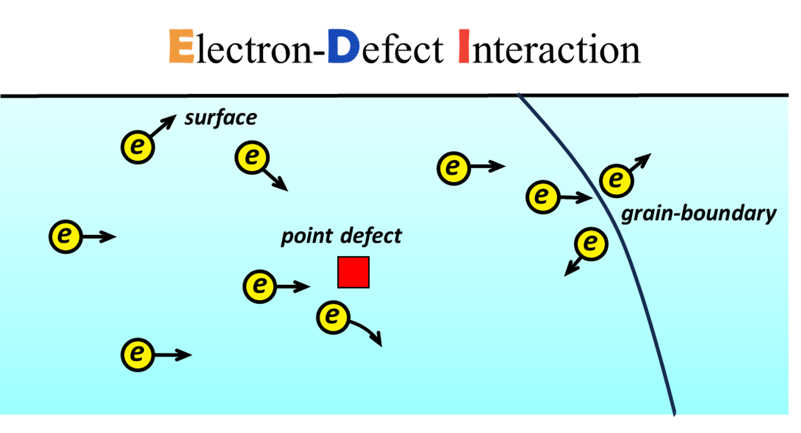
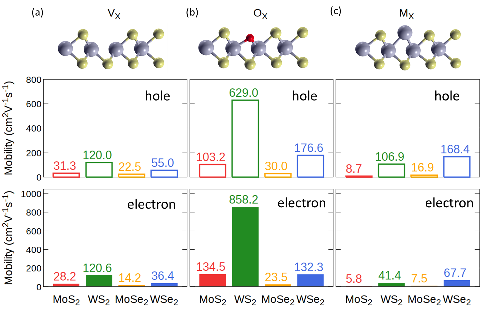
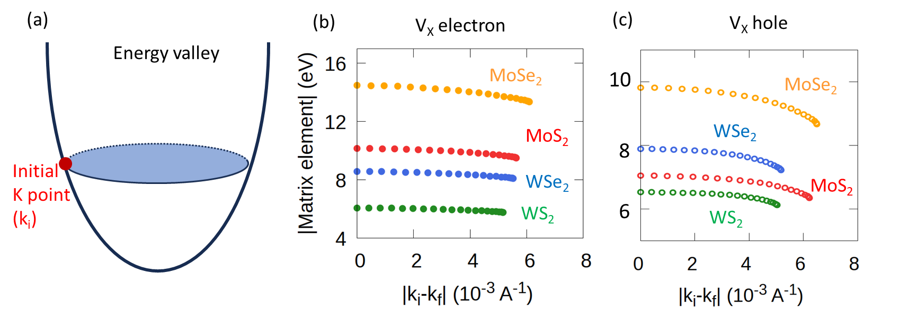

  {:refdef: style="text-align: center;"}
 {:height="487px" width="900px"}
  {: refdef}

Electron-defect interaction is crucial to many processes and applications such as charge transport and light absoprtion/emssion. **EDI** (**e**lectron-**d**efect **i**nteraction) is a software package to calculate the electron-defect interaction and the associated properties from first principles. 

# Capabilities

Currently, EDI can calculate the following quantities for charge-neutral point defect:

- EDI matrix
- scattering rate/relaxation time
- carrier mobility/conductivity 

We are also implementing or will implement methods for calculating:

- charged defects
- surfaces
- grain boundaries

# Example

Here is the point-defect-limited mobility in monolayer transition metal dichalcogenides calculated with EDI.
The defect concentration is $10^{12} cm^{-2}$.

  {:refdef: style="text-align: center;"}
   {:height="552px" width="830px"}
  {: refdef}

Below are matrix elements of EDI for chalcogen vacancy.

  {:refdef: style="text-align: center;"}
   {:height="314px" width="858px"}
  {: refdef}

For details of the above figures, see the [publication](https://pubs.acs.org/doi/10.1021/acsnano.4c01033).

# Reference

 Zhongcan Xiao, Rongjing Guo, Chenmu Zhang, and Yuanyue Liu. Point Defect Limited Carrier Mobility in 2D Transition Metal Dichalcogenides.  ACS Nano.  [DOI: 10.1021/acsnano.4c01033](https://pubs.acs.org/doi/10.1021/acsnano.4c01033)

